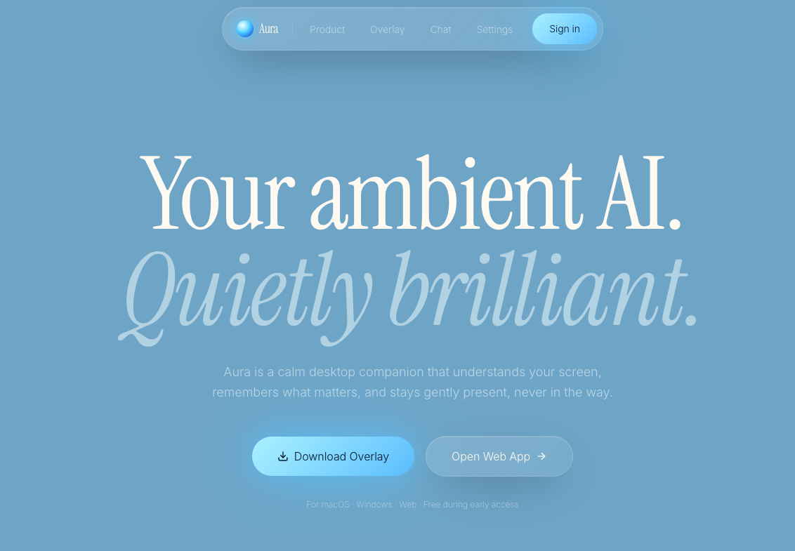
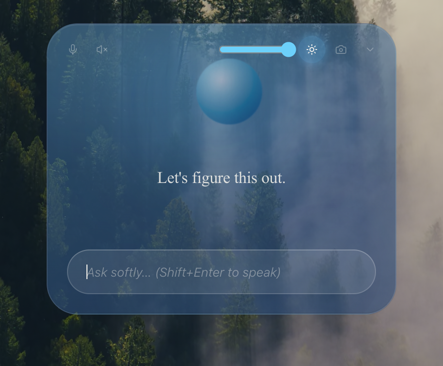
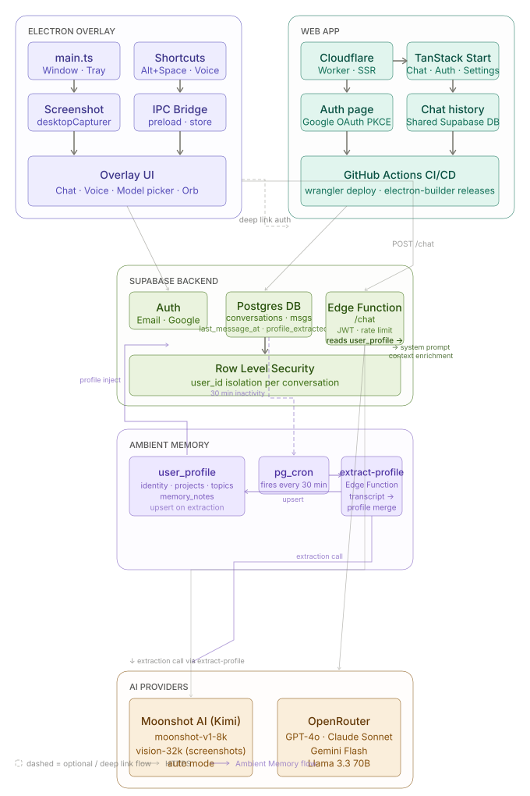

<p align="center">
  
</p>

<h1 align="center">Aura</h1>

<p align="center">
  An ambient AI companion that lives on your desktop.<br/>
  It sees your screen, understands your context, and stays out of the way until you need it.
</p>

<p align="center">
  <a href="https://aura.aura-companion.workers.dev">Web App</a> &nbsp;|&nbsp;
  <a href="https://github.com/IsmailMoudden/aura-companion/releases/latest">Download</a> &nbsp;|&nbsp;
  <a href="#shortcuts">Shortcuts</a> &nbsp;|&nbsp;
  <a href="#development">Development</a>
</p>

<p align="center">
  
  
  
  
</p>

<br/>

<p align="center">
  
</p>

<br/>

## Overview

Aura is not an app you open. It floats above your desktop, always one shortcut away. It sees your screen, responds to your questions in plain language, and disappears when you're done.

**Two surfaces:**

- **Desktop overlay** — a transparent, always-on-top Electron window. Summon it with `Alt+Space`, ask anything, dismiss it. Screen context is captured automatically on every message.
- **Web app** — full conversational interface with history and multi-model access at [aura.aura-companion.workers.dev](https://aura.aura-companion.workers.dev)

Both share the same Supabase backend, so your conversation history is always in sync.

<br/>

## Download

| Platform | Installer |
|---|---|
| macOS Apple Silicon | [Aura-arm64.dmg](https://github.com/IsmailMoudden/aura-companion/releases/latest/download/Aura-arm64.dmg) |
| macOS Intel | [Aura-x64.dmg](https://github.com/IsmailMoudden/aura-companion/releases/latest/download/Aura-x64.dmg) |
| Windows x64 | [Aura-x64.exe](https://github.com/IsmailMoudden/aura-companion/releases/latest/download/Aura-x64.exe) |

Free during early access.

> **macOS note:** The app is unsigned. On first launch, right-click and choose Open, or run `xattr -cr /Applications/Aura.app` in Terminal.

<br/>

## Shortcuts

| Shortcut | Action |
|---|---|
| `Alt+Space` | Summon / dismiss overlay |
| `Alt+Shift+S` | Capture screenshot manually |
| `Alt+Shift+H` | Toggle invisible mode (hidden from screen recording) |
| `Shift+Enter` | Trigger voice input |
| `Alt+Arrow` | Nudge overlay position |

<br/>

## Architecture

<p align="center">
  
</p>

<br/>

## Stack

| Layer | Tech |
|---|---|
| Desktop | Electron 39, transparent overlay, always-on-top |
| Framework | TanStack Start (React 19 + TanStack Router) |
| Styling | Tailwind CSS v4, custom design tokens |
| AI | Kimi K2.6 (Moonshot AI), with vision support |
| AI extras | GPT-4o, Claude Sonnet, Gemini Flash, Llama 3.3 via OpenRouter |
| Backend | Supabase (auth, database, edge functions) |
| Hosting | Cloudflare Workers |
| Build | Vite 7, esbuild, electron-builder, Bun |

<br/>

## Ambient Memory

Aura builds a living model of who you are — silently, in the background, without ever asking.

Every conversation you have is analysed after 30 minutes of inactivity. A secondary AI pass reads the full transcript and extracts structured facts: what you're building, what stack you're using, how you communicate, what keeps coming up. These facts are merged into a persistent `user_profile` stored in Supabase, and injected quietly into Aura's system prompt on every future request.

The result: Aura gets sharper over time. It stops asking you to explain your stack. It knows you prefer concise answers. It remembers that you're shipping on Cloudflare and that your overlay is Electron-based. It references your actual projects by name.

**How it works:**

```
Every message you send
  └── stored in Supabase (conversations + messages)

Every 30 minutes — pg_cron fires
  └── finds conversations inactive since 30min, not yet processed
  └── sends full transcript to Kimi for structured extraction
      └── identity  { name, job, timezone, languages, style }
      └── projects  [{ name, stack[], description, status }]
      └── topics    [{ label, count }] — ranked by frequency
      └── notes     [{ fact }] — free-form observations
  └── merges extracted data into user_profile (upsert, no overwrites)

Next time you open Aura
  └── profile is loaded and injected into system prompt
  └── Aura already knows who you are
```

**Profile schema** (`user_profile` table):

| Field | Type | Description |
|---|---|---|
| `identity` | `jsonb` | Name, job, timezone, languages, communication style |
| `projects` | `jsonb[]` | Active projects with stack, description, status |
| `topics` | `jsonb[]` | Recurring themes ranked by frequency across sessions |
| `memory_notes` | `jsonb[]` | Free-form facts (max 50, deduplicated) |
| `profile_updated_at` | `timestamptz` | Last extraction timestamp |

The profile is **never shown to you directly** — it lives entirely in the model's context. No memory UI, no review screen. It just makes Aura feel like it knows you.

> Privacy note: all profile data is stored in your own Supabase project, isolated by RLS. Nothing leaves your instance.

<br/>

## Web app URL

The Electron dashboard window loads the web app at the URL defined by `VITE_WEB_URL`.

**Current URL:** `https://aura.aura-companion.workers.dev`

If the web app is redeployed to a new domain, update this in two places:

1. `.env` and `.env.production`:
   ```
   VITE_WEB_URL=https://your-new-domain.com
   ```
2. GitHub Actions secret `VITE_WEB_URL` (Settings → Secrets → Actions)

Then tag a new release to rebuild the Electron app with the updated URL:
```bash
git tag v0.x.x
git push origin v0.x.x
```

<br/>

## Auth flow

The overlay has no login form. When signed out, clicking the orb opens the web app at `?overlay=true`. After sign-in, the web app redirects to `aura://auth?access_token=...`. Electron intercepts the deep link and stores the session via `electron-store`.

Add this URL in **Supabase > Authentication > URL Configuration > Redirect URLs**:
```
aura://auth
```

<br/>

## Development

```bash
bun install

cp .env.example .env
# Fill in your keys

# Web app
bun dev

# Electron overlay
bun run electron:dev
```

### Environment variables

| Variable | Description |
|---|---|
| `VITE_SUPABASE_URL` | Supabase project URL |
| `VITE_SUPABASE_PUBLISHABLE_KEY` | Supabase anon key |
| `VITE_WEB_URL` | Public URL of the web app |
| `KIMI_API_KEY` | Moonshot AI key (set as Supabase secret) |
| `OPENROUTER_API_KEY` | OpenRouter key (set as Supabase secret) |

<br/>

## Building

```bash
# macOS
bunx electron-builder --mac dmg --arm64 --publish never
bunx electron-builder --mac dmg --x64 --publish never

# Windows
bunx electron-builder --win nsis --x64 --publish never
```

Releases are built automatically via GitHub Actions on every `v*` tag:

```bash
git tag v0.4.0
git push origin v0.4.0
```

<br/>

## Deploying the edge function

```bash
supabase secrets set KIMI_API_KEY=sk-...
supabase secrets set OPENROUTER_API_KEY=sk-or-...
supabase functions deploy chat --project-ref <your-project-ref>
```

The workflow in `.github/workflows/deploy-functions.yml` deploys automatically on push to `main` when files in `supabase/functions/` change.

<br/>

## GitHub Actions secrets

| Secret | Description |
|---|---|
| `VITE_SUPABASE_URL` | Supabase project URL |
| `VITE_SUPABASE_PUBLISHABLE_KEY` | Supabase anon key |
| `VITE_WEB_URL` | Public URL of the web app |
| `SUPABASE_PROJECT_REF` | Supabase project ref |
| `SUPABASE_ACCESS_TOKEN` | Supabase CLI access token |

<br/>

## Contributing

1. Fork the repo
2. Create a branch: `git checkout -b feat/your-feature`
3. Commit your changes: `git commit -m 'feat: your feature'`
4. Push and open a pull request

<br/>

## License

MIT. See [LICENSE](LICENSE).
